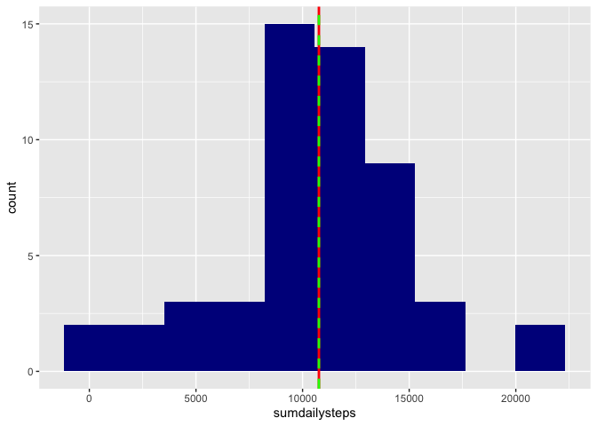
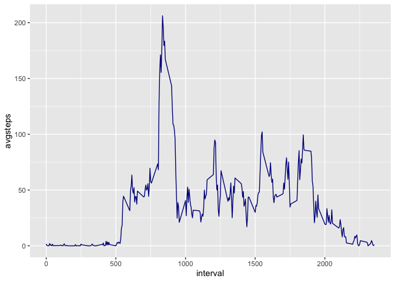
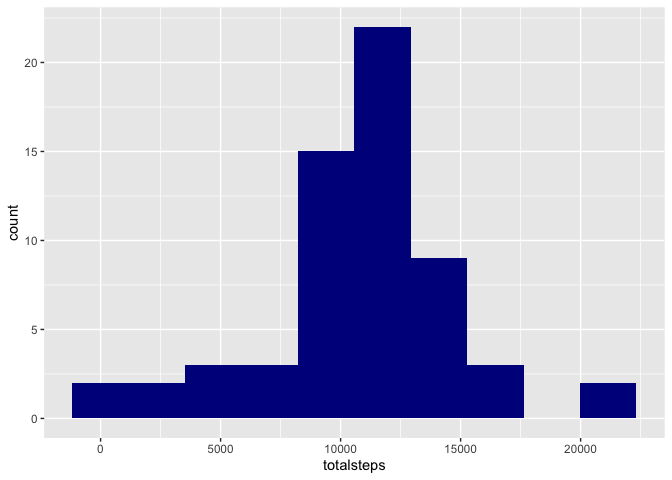
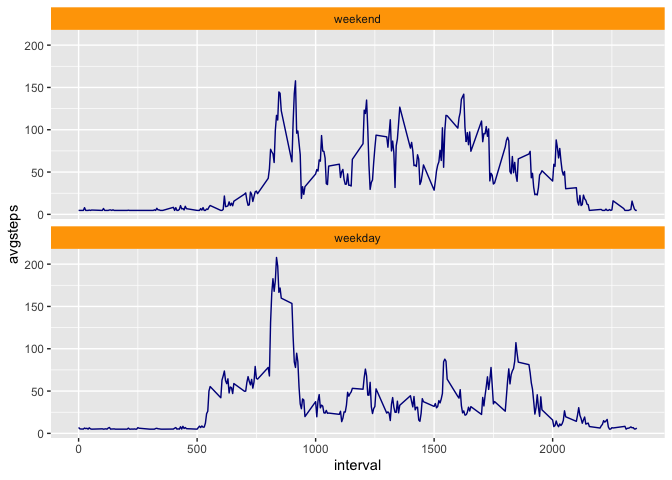

## Loading and preprocessing the data

```r
##read data from csv file.
activity <-read.csv("activity.csv", header =TRUE, sep=",")
```


## What is mean total number of steps taken per day?


```r
##subset to get dailysteps data and remove na rows.
dailysteps <-subset(na.omit(activity), select =c(steps, date))

##get daily total steps.
totaldailysteps <-dailysteps %>%
                        group_by(date)%>%
                        summarise(sumdailysteps=sum(steps))

#Make histgram to show daily total steps.
ggplot(totaldailysteps, aes(x=sumdailysteps))+geom_histogram(bins = 10, fill="darkblue")+
        geom_vline(aes(xintercept=mean(sumdailysteps)),
            color="red",  size=1) +
         geom_vline(aes(xintercept=median(sumdailysteps)),
            color="green", linetype="dashed",size=1)
```

<!-- -->


The mean of total steps per day is: 

```r
round(mean(totaldailysteps$sumdailysteps),2)
```

```
## [1] 10766.19
```

The median of total steps per day is: `

```r
median(totaldailysteps$sumdailysteps)
```

```
## [1] 10765
```

## What is the average daily activity pattern?

```r
##subset to get dailyintervalsteps data and remove na rows.
dailyintervalsteps <-subset(na.omit(activity), select =c(steps, date, interval))

##get average daily activity.
avgdaily <-dailyintervalsteps %>%
                        group_by(interval)%>%
                        summarise(avgsteps=mean(steps))


#time series plot to see the average number of steps taken.
ggplot(avgdaily, aes(x=interval, y=avgsteps, type="l"))+geom_line(colour="darkblue")
```

<!-- -->

Below interval contains the max number of average steps:


```r
avgdaily[which.max(avgdaily$avgsteps),]
```

```
## # A tibble: 1 x 2
##   interval avgsteps
##      <int>    <dbl>
## 1      835     206.
```

## Imputing missing values
1. calculate total number of missing value rows in dataset: 

```r
sum(is.na(activity))
```

```
## [1] 2304
```

2. fill all the missing value fields with mean average steps of the day & create new dataset.

```r
#calculate average steps in activity df.
averagemissing <-apply(activity[,1, drop=F],2,mean, na.rm=TRUE)

#create new dataset - adding a variable to replace na steps with daily average steps.
avgstepsna<- activity%>%
        mutate(activitysteps =ifelse(is.na(steps), averagemissing,steps))


#create dataset to show daily total steps per day.
newactivity <-avgstepsna[,c(2,4)]%>%
        group_by(date)%>%
        summarise(totalsteps =sum(activitysteps))
```

4. New histgram to show daily average steps 

```r
ggplot(newactivity, aes(x=totalsteps))+geom_histogram(bins = 10, fill="darkblue")
```

<!-- -->

The mean of total daily steps are: 

```r
mean(newactivity$totalsteps)
```

```
## [1] 10766.19
```
This is the same as when na is ignores in steps.

The median of total daily steps are: 

```r
median(newactivity$totalsteps)
```

```
## [1] 10766.19
```
The median figure changed slightly compared to Question 1. when na removed from steps:

```r
median(totaldailysteps$sumdailysteps)
```

```
## [1] 10765
```


## Are there differences in activity patterns between weekdays and weekends?

```r
#add weekday to dataset avgstepsna.
weekdays1 <- c('Monday', 'Tuesday', 'Wednesday', 'Thursday', 'Friday')
avgstepsna$wDay <- factor((weekdays(as.Date(avgstepsna$date)) %in% weekdays1), 
         levels=c(FALSE, TRUE), labels=c('weekend', 'weekday') )

#make a new dataset to show average steps per interval.
avgstepsperinterval <-avgstepsna[,3:5] %>%
        group_by(interval, wDay)%>%
                summarise(avgsteps =mean(activitysteps))


##make a plot to show if activity is different from weekdays and weekends.
ggplot(avgstepsperinterval, aes(x=interval, y=avgsteps, type="l"))+geom_line(colour="darkblue")+facet_wrap(~wDay, nrow=2)+theme(strip.background = element_rect(fill="orange"))
```

<!-- -->

